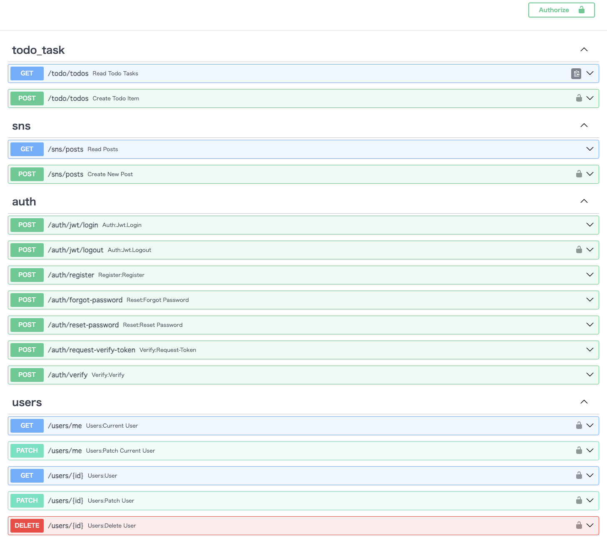

### fastapi_users_app.py

##### APIにより、認証機能とアプリ機能を実現

- API: User 認証機能-JWT(Json Web Token)を利用した認証
- アプリ機能
  - todoアプリ
  - SNSアプリ

### URLと機能の一覧

##### routers/user_router.py

| URL                  | 機能                            |
| -------------------- | ------------------------------- |
| /auth/jwt/login      | JWTを使用したユーザーログイン   |
| /auth/jwt/logout     | JWTを使用したユーザーログアウト |
| /auth/register       | 新規ユーザーの登録              |
| /auth/reset-password | パスワードリセット              |
| /auth/verify         | ユーザーのメールアドレス確認    |
| /users/{user_id}     | ユーザー情報の取得・更新・削除  |

##### routers/todo_task_router.py

| URL    | 機能                       |
| ------ | -------------------------- |
| /todos | ToDoタスクの取得（リスト） |
| /todos | ToDoタスクの作成           |

##### routers/sns_router.py

| URL    | 機能                    |
| ------ | ----------------------- |
| /posts | SNS投稿の取得（リスト） |
| /posts | SNS投稿の作成           |

##### API一覧

